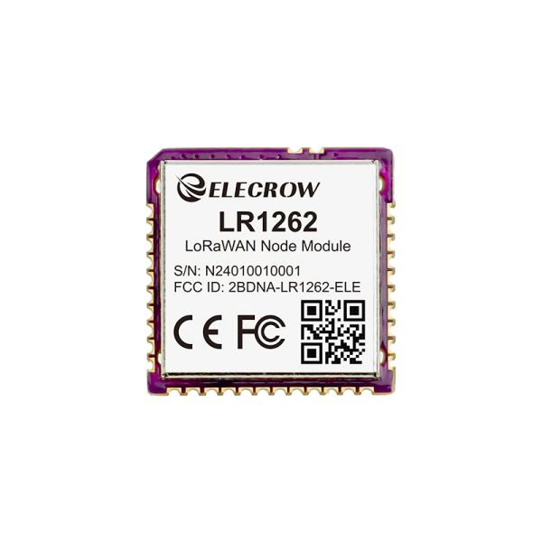
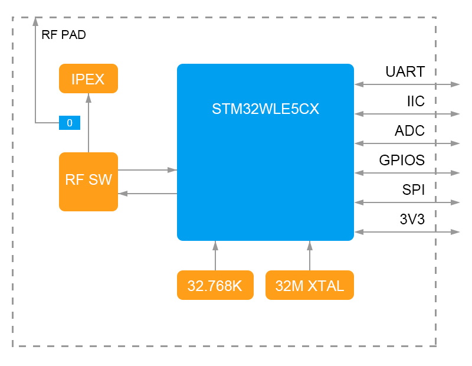
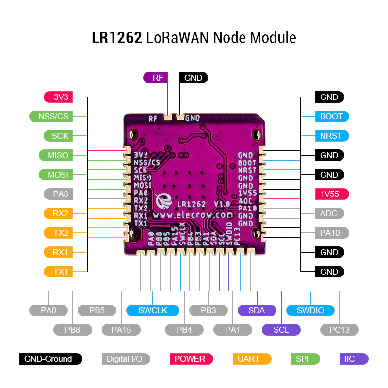

### 1, Product picture

#### Product Links:

https://www.elecrow.com/lr1262-lorawan-node-module-support-full-frequency-band.html

#### Case Applications

------

##### [**Case 1: Single-channel Application Routines For Single-channel Gateways And Nodes**](https://www.elecrow.com/pub/wiki/Case1_Single-channel_application_routines_for_single-channel_gateways_and_nodes.html)

##### [**Case 2: Multi-Channel Application Routine For Single-Channel Gateways And Nodes**](https://www.elecrow.com/pub/wiki/Case2_Multi-Channel_Application_Routine_for_Single-Channel_Gateways_and_Nodes.html)

##### [**Case 3: Single-channel Application Routines for Raspberry Pi Gateways and Nodes**](https://www.elecrow.com/pub/wiki/Case3_Single-channel_Application_Routines_for_Raspberry_Pi_Gateways_and_Nodes.html#frequency-selection)

##### [**Case 4: Multi-Channel Application Routine for Raspberry Pi Gateways and Nodes**](https://www.elecrow.com/pub/wiki/Case4_Multi-Channel_Application_Routine_for_Raspberry_Pi_Gateways_and_Nodes.html#2-lr1262-node)

##### [**Case 5: LR1262 Point-to-Point Communication Application Example**](https://www.elecrow.com/pub/wiki/Case5_LR1262_Point-to-Point_Communication_Application_Example.html)

### 2, Product version number

|      | Hardware | Software | Remark |
| ---- | -------- | -------- | ------ |
| 1    | V1.0     | V1.0     | latest |

### 3, product information

| MCU                     | STM32WLE5CCU6（ARM Cortex-M4 32-bit，256-Kb Flash，64-Kb RAM） |
| ----------------------- | ------------------------------------------------------------ |
| RF chip                 | SX1262 Chip                                                  |
| Transmit power TX       | 22 dBm@Max                                                   |
| Receive sensitivity RX  | l -123 dBm for 2-FSK (1.2 Kbit/s)l -148 dBm for LoRa®        |
| Minimum sleep current   | 1.69 μA (maximum not exceeding 2.0 μA)                       |
| Working current         | Transmission: 87 mA (@20dBm 868Mhz)Receive: 5.2 mA           |
| Communication Interface | UART/SPI                                                     |
| Peripheral interface    | UART, I2C, SPI, ADC, GPIO                                    |
| signal modulation       | LoRa®、(G)FSK、(G)MSK 、BPSK                                 |
| LoRaWAN protocol        | Class A/B/C (compliant with LoRaWAN 1.0.3 specification)     |
| Airspeed                | 0.018~62.5 Kbit/s                                            |
| Frequency Range         | 150 MHz to 960 MHz                                           |
| Support frequency band  | EU868、US915                                                 |
| Communication distance  | 5~7 km                                                       |
| ECC function            | Built-in main control                                        |
| Operating Voltage       | 3.3V                                                         |
| Antenna form            | Supports stamp holes or IPEX antenna mounts                  |
| Package form            | Patch, stamp hole, 32pin                                     |
| Dimensions              | 16*16*3.5mm                                                  |
| Weight                  | 3g                                                           |

### 4,Folder structure.

|--Datasheet: Includes datasheets for components used in the project, providing detailed specifications, electrical characteristics, and pin configurations.

### 5,Hardware Overview

## 

## Interface Function

